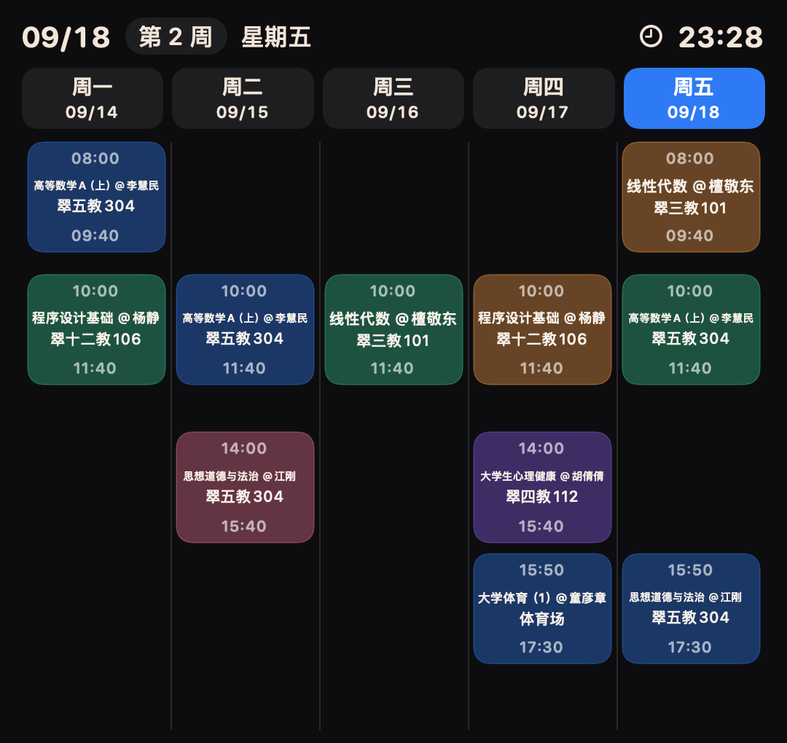

# 聚在工大 · iOS（HFUT-Schedule）

> 合肥工业大学校园服务 App 的原生 **iOS / SwiftUI** 版本。
> 本仓库基于原 Android 项目 [Chiu-xaH/HFUT-Schedule](https://github.com/Chiu-xaH/HFUT-Schedule) 移植，保留上游 Android 源码，iOS 端使用 SwiftUI 重写界面与交互，并复用原项目整理的全部校方接口。



## 下载与安装

- 最新 IPA：[Releases](https://github.com/xiaozhangwangxue/HFUT-Schedule/releases)（`ios-*` 标签）
- 仓库内也直接提供构建产物：[`ios/HFUTSchedule/dist/`](ios/HFUTSchedule/dist)

IPA 使用**免费个人团队临时签名**，有效期 7 天；过期后重新安装即可。可用 SideStore / iLoader / AltStore 等工具重新签名安装到自己的设备。

## 功能

### 课表
- 周课表：周次切换、隐藏周六日、今天高亮、课程块按真实时间比例排布
- 课程卡片点击进入详情：教师、学分、周次、上课安排、同班同学、教室状态、挂科率、开课查询
- 离线手动课表、课表备份与恢复、导出到系统日历、上课提醒、系统快捷指令
- 大号**桌面小组件「周课表」**：一屏显示周一到周五全部课程，顶部显示日期／周次／星期与实时时钟，今天用强调色高亮

### 教务（统一身份认证后自动同步）
- 统一身份认证（CAS），一次登录复用会话，无需每个栏目重复登录
- 教务系统：课表同步、成绩、考试安排、培养方案、选课、评教、课程汇总、转专业、全校课程查询
- 支持「校园网直连」与「校外 WebVPN」两种连接方式

### 查询中心（48 项校园服务）
- 一卡通余额与流水、宿舍电费、校园网、洗浴、洗衣（智慧笑联）、第二课堂
- 图书馆检索／在借书籍、空教室、挂科率、同班同学、智慧社区、今日校园
- 慧新易校（校园卡、电费、洗浴、洗衣聚合平台）、费用中心（欠费明细与缴费二维码）
- 作息与校历、节假日调休、网址导航（收藏夹 + 实验室）、WebVPN、快递取件码、校园地图、学期报告

## 环境要求

- iOS 17.0 及以上
- Xcode 16 及以上（当前在 Xcode 27.2 beta 上验证）
- [XcodeGen](https://github.com/yonaskolb/XcodeGen)：`brew install xcodegen`

## 构建

```bash
cd ios/HFUTSchedule
xcodegen generate
xcodebuild -project HFUTSchedule.xcodeproj -scheme HFUTSchedule \
  -sdk iphoneos -configuration Release \
  CODE_SIGNING_ALLOWED=NO build
```

一键生成临时签名 IPA 并安装到已连接设备：

```bash
./ios/HFUTSchedule/scripts/build_temporary_signed_ipa.sh <设备 UDID> yes
```

其它脚本：

- `scripts/finish_widget_install.sh`：刷新小组件快照 → 申请描述文件 → 签名 → 安装 → 输出 IPA
- `scripts/sync_widget_snapshot.sh`：从真机拉取课表并写入小组件包内快照
- `scripts/render_widget_preview.swift`：把小组件视图渲染成 PNG，便于在不装机的情况下检查排版

## 目录结构

```
HFUT-Schedule
├── app/                     # 上游 Android 应用源码（未改动）
├── network-api/             # 上游网络层：校方接口定义与数据模型
├── common-logic/ common-ui/ # 上游公共模块
├── docs/                    # 上游文档，含 docs/HfutApi.md 校内接口收集
└── ios/HFUTSchedule/        # iOS 工程（本仓库新增）
    ├── HFUTSchedule/        # SwiftUI 应用源码
    ├── HFUTScheduleWidget/  # 桌面周课表小组件
    ├── Shared/              # 主应用与小组件共享的数据通道与视图
    ├── HFUTScheduleTests/   # 单元测试（接口解析、目录、密码规则等）
    ├── scripts/             # 构建 / 签名 / 小组件脚本
    ├── docs/                # 小组件预览图
    ├── dist/                # 构建产物（IPA）
    └── project.yml          # XcodeGen 工程定义（工程文件的唯一来源）
```

## 小组件数据通道

免费个人团队不支持 App Groups，因此小组件按优先级使用三级数据通道：

1. App Group（付费团队签名时自动生效）
2. 共享钥匙串（免费团队描述文件自带 `TEAM.*` keychain 分组）
3. 包内 `ScheduleSnapshot.json`（构建时从真机拉取的课表快照，保证任何时候都有内容）

主应用每次保存、导入或同步课表都会刷新前两条通道并请求 `WidgetCenter` 重载时间线。

## 已知说明

- 校方接口随时可能调整，如遇某个栏目提示登录失败或数据为空，请先在「选项 → 安全登录」重新完成一次统一身份认证
- 临时签名版本 7 天后失效，属免费开发者账号限制
- 校内地址（如 `121.251.19.62`、`jxglstu.hfut.edu.cn`）在校外需要开启 WebVPN

## 上游项目

Android 版本与全部校方接口文档来自 [Chiu-xaH/HFUT-Schedule](https://github.com/Chiu-xaH/HFUT-Schedule)，其文档同样适用于本仓库的上游部分：

- [更新日志](docs/update)
- [开发者文档](docs/Developer.md)
- [校内 Api 收集](docs/HfutApi.md)
- [DeepLink 说明](docs/DeepLink.md)

## 许可

本仓库沿用上游 [Apache License 2.0](LICENSE)。接口与数据均来自学校公开系统，仅供学习交流使用。
